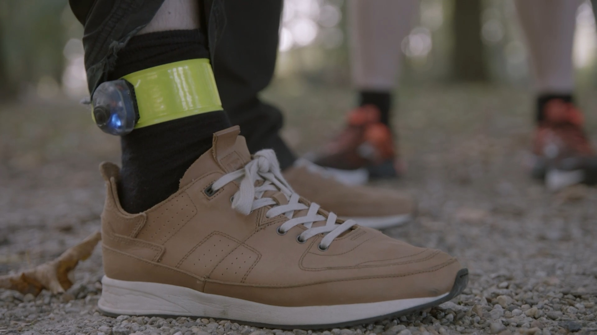
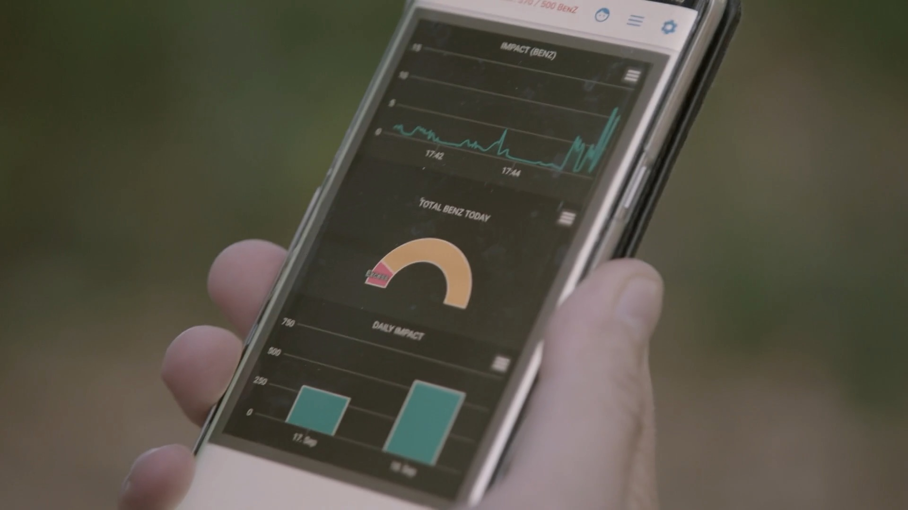

# TheBenZ

Deze git repository bevat de code en hardware schemas voor de loop hulp voor Ben van het programma [Team Scheire](https://www.canvas.be/team-scheire). De aflevering kan herkeken worden op [VRT NU](https://www.vrt.be/vrtnu/a-z/team-scheire/7/team-scheire/).

Naast een sportief en klinisch onderzoek is er ook een kleine sensor ontwikkeld die de impact op het been meet en omzet naar een waarde (in het programma als BenZ uitgedrukt) en deze via Bluetooth Low Energy doorstuurt naar een smartphone. hierop kan tijdens of na de training gezien worden wat de impact was tijdens het lopen en hoeveel stappen er gezet zijn.

Het toestel dat op de enkel kan gedragen worden bevat een nRF32 SoC voor BLE en een acclerometer om de schokken op te meten. Automatisch calibratie, filtering en verwerking van de data gebeurd op de Cortex-M4 van de nRF32 en de verwerkte data wordt - indien er een verbinding is - doorgestuurd naar de smartphone.

Dit is de resultateren sensor, ingegoten in epoxy:

En een screenshot van de applicatie. Deze is ontwikkeld met behulp van het [Cordova](https://cordova.apache.org/) framework.

In de folder [hardware](./hardware) kan je de PCB en de gebruikte componenten terugvinden. In de folder [firmware](./firmware) de software voor op de sensor. en in de folder [app](./app) de code voor op de smartphone (is enkel voor Android getest).